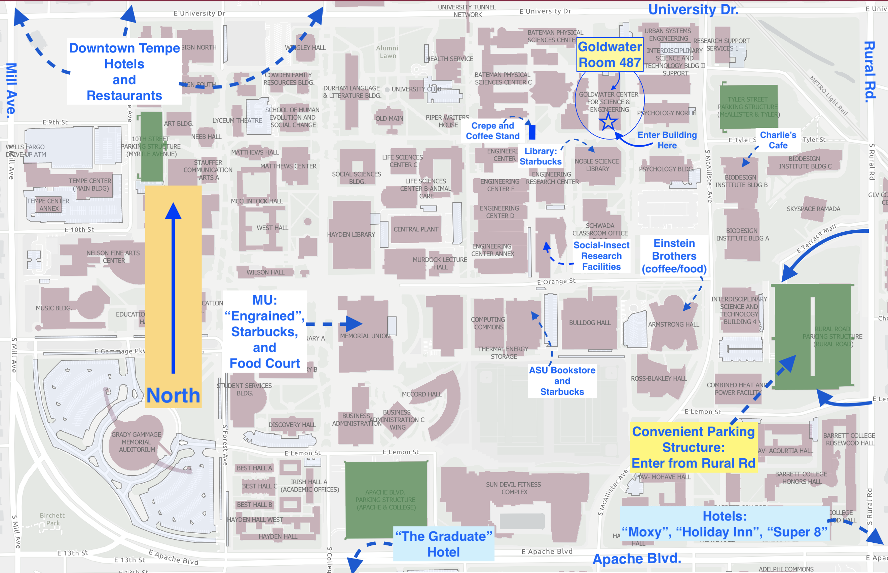
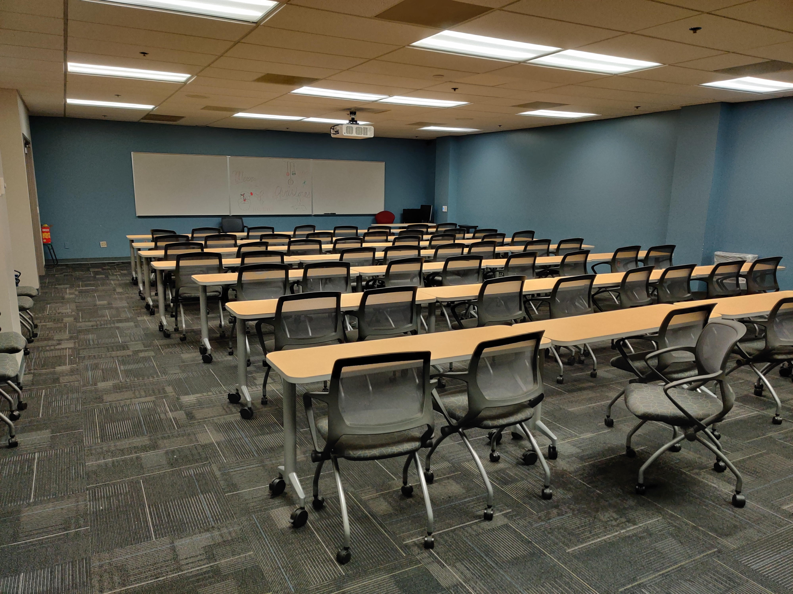
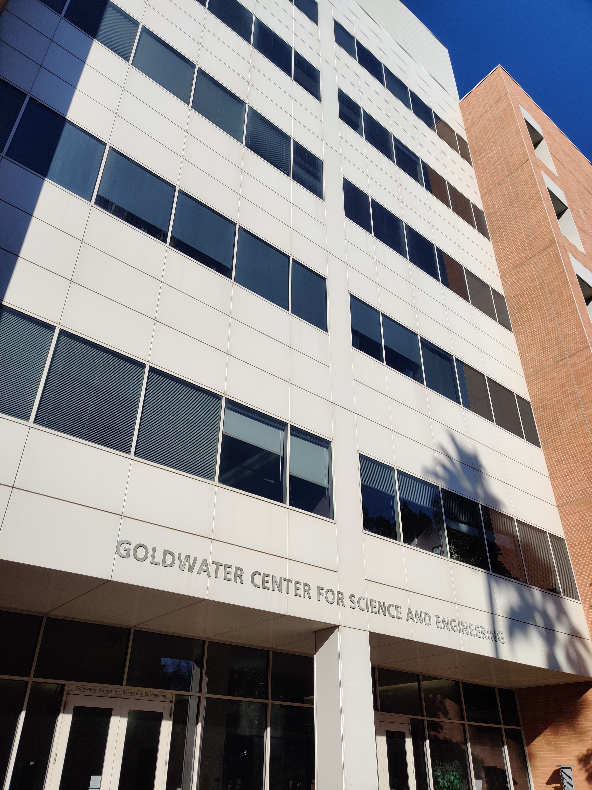

{div align="center"}
[{:height="50px"}](http://engineering.asu.edu/) [{:height="50px"}](http://www.darpa.mil/)
{/div}

**BICMEE 2020** gathers experts (including DARPA micro-BRAIN performers), who have interests in Bio-Inspired Computing for Miniaturization and Energy Efficiency. The meeting will focus on sharing progress and potential ideas for future work in this area. The meeting will be hosted at [Arizona State University](http://www.asu.edu/) with support from the [Ira A. Fulton Schools of Engineering](https://engineering.asu.edu/). Attendance is free, but due to limited seating, [**registration in advance**](http://bit.ly/bicmee2020registration) is required.

You may download the [workshop program](BICMEE2020_program.pdf) or view details about the event below.

* [Registration](#registration)
* [Workshop Goals](#workshop-goals)
* [Schedule of Events](#schedule-of-events)
* [Meeting Location](#meeting-location) ([Parking Information](#parking-on-campus))
* [Nearby Lodging](#meeting-location)
* [Local Organizing Committee](#local-organizing-committee)
* [Sponsors](#sponsors)

# Registration

Although attendance to BICMEE 2020 is free, [**registration in advance**](http://bit.ly/bicmee2020registration) is required because of space limitations for the workshop. If you wish to attend the workshop, register at: [http://bit.ly/bicmee2020registration](https://bit.ly/bicmee2020registration)

# Workshop Goals

1. Discuss research progress in the projects related to using bio-inspiration to develop new architectures for energy efficient miniaturized computing, with the goal of information sharing and productive feedback
1. Discuss potential future directions for this research, including the role that bio-inspired research may play in potential DARPA initiatives as well as technology transfer to industry
1. Identify potential synergies in our current and future research programs

# Schedule of events

The 1-day event takes place on February 28, 2020. Although no meals are provided, coffee and light refreshments will be provided at certain times during the day.

## Friday, 28 February 2020

|             | OPENING REMARKS |
| ----------- | --------- |
| 08:30–09:00 | Sethuraman "Panch" Panchanathan, ASU EVP and Chief Research and Innovation Officer |

|             | PLENARY |
| ----------- | ------------------------ |
| 09:00–10:00 | Sean O'Donnell, Drexel University, Professor and Interim Department Head |
|             | _**Abstract:** Brain investment-constraints on growth and development are pervasive in animals, and comparative analyses suggest that brain miniaturization is limited in magnitude relative to most other body structures. I will illustrate some basic patterns of brain/body allometry using my own data from social wasps (Vespidae), and I will explore how major ecological shifts can break clade-typical brain/body allometries. Wasp body allometry patterns also suggest that the need to accommodate relatively large brains can impact body plans as smaller body sizes evolve within a lineage; the challenges of brain housing may even set lower limits on body size. I propose that brain/body allometry is an important overlooked factor in the evolutionary ecology of animal body size. I will then review some (bizarre) examples of brain-driven body plan changes in animal lineages pursuing extreme miniaturization, and I will discuss some of the physiological and cellular limits on the size reduction of brain themselves._ |

|             | COFFEE BREAK |
| ----------- | ------------ |
| 10:00–10:20 | Coffee and light refreshments will be provided |

|             | SESSION: BIOLOGICAL CASE STUDIES IN MINIATURIZATION |
| ----------- | --------------------- |
| 10:40-12:00 | Jon Harrison, Brian Smith, Meghan Bennett, Meghan Duell, Majid Ghaninia |

|             | LUNCH (not provided) |
| ----------- | ------------ |
| 12:00–13:00 | Restaurants are nearby within walking distance |

|             | SESSION: COMPUTATIONAL MODELING |
| ----------- | -------------------- |
| 13:00–14:20 | Maxim Bazhenov, Seth Haney, +2, +Intel |

|             | COFFEE BREAK |
| ----------- | ------------ |
| 14:20–14:40 | Coffee and light refreshments will be provided |

|             | SESSION: NEUROMORPHIC COMPUTING |
| ----------- | -------------------- |
| 14:40–16:00 | Kevin Cao, +1, +Raytheon |

# Meeting Location

The workshop will take place in [Goldwater Center (GWC), Room 487](https://gis.m.asu.edu/asucampus/?query=CampusBuilding_7147_1%2CName%2CGoldwater%20Center%20for%20Science%20& Engineering=&extent=-12460266.7297%2C3951200.172%2C-12459908.7297%2C3951380.217%2C102100). Mid-morning and mid-afternoon coffee breaks will be provided on-site. Attendees are on their own for breakfast, lunch, and dinner, but restaurants are within walking distance.

[Goldwater Center (GWC)](https://gis.m.asu.edu/asucampus/?query=CampusBuilding_7147_1%2CName%2CGoldwater%20Center%20for%20Science%20& Engineering=&extent=-12460266.7297%2C3951200.172%2C-12459908.7297%2C3951380.217%2C102100), Room 487 
[650 E. Tyler Mall](https://goo.gl/maps/JqzLdjv2vGUncwiRA) [(Google Maps link)](https://goo.gl/maps/JqzLdjv2vGUncwiRA) 
Tempe, AZ  85281

[{:width="500px"}](ASUmap.png)

{:height="230px"} [{:height="230px"}](https://goo.gl/maps/JqzLdjv2vGUncwiRA)

## Parking on Campus

The Rural Road parking structure (see [map above](ASUmap.png)) is
a convenient location to park for workshop attendees. Take a ticket when
entering the garage and pay when exiting either at kiosks or at the
actual exit gates.

From the Rural Road parking structure:
* Walk west toward McAllister Ave.
* Walk north on McAlister
* Use crosswalk between Psychology Bldg and Biodesign Bldg B
* Walk west until encountering Goldwater on your right

# Nearby Lodging

There are several hotels near the ASU Tempe campus. Two that are particularly close to the meeting location are:

| The Graduate (Apache and College)       | Moxy (Apache and Rural) |
| --------------------------------------- | ---------------------------- |
| 225 E. Apache Blvd                      | 1333 S. Rural Rd             |
| Tempe, AZ  85281                        | Tempe, AZ  85281             |
| (480) 967-9431                          | (480) 968-3451               |
| <a target="_blank" href="https://www.graduatehotels.com/tempe/">https://www.graduatehotels.com/tempe/</a>   |  <a target="_blank" href="http://moxy-hotels.marriott.com/en/hotels/tempe">http://moxy-hotels.marriott.com/en/hotels/tempe</a>  |

Other walkable options to consider are (ordered by proximity):
* [Holiday Inn Express Tempe](https://www.ihg.com/holidayinnexpress/hotels/us/en/tempe/phxwb/hoteldetail) (Apache and Rural)
* [Super 8 Motel Tempe](https://www.wyndhamhotels.com/super-8/tempe-arizona/super-8-tempe-asu-airport/overview) (Apache and Rural)
* [Residence Inn DOWNTOWN Tempe](https://www.marriott.com/hotels/travel/phxrt-residence-inn-tempe/) (Forest and 5th)
* [Courtyard by Marriott Tempe Downtown](https://www.marriott.com/hotels/travel/phxte-courtyard-tempe-downtown/) (Ash and 6th St.)

# Local Organizing Committee

* Brian Smith ([BrianHSmith@asu.edu](mailto:BrianHSmith@asu.edu)), [ASU SOLS](http://sols.asu.edu/)
* Jon Harrison ([j.harrison@asu.edu](mailto:j.harrison@asu.edu)), [ASU SOLS](http://sols.asu.edu/)
* Kevin Cao ([Yu.Cao@asu.edu](mailto:Yu.Cao@asu.edu)), [ASU SECEE](https://ecee.engineering.asu.edu/)
* Thedoore (Ted) Pavlic ([tpavlic@asu.edu](mailto:tpavlic@asu.edu)), [ASU CIDSE](https://cidse.engineering.asu.edu/)

# Sponsors

This workshop can take place due to support in some form from:

* [Arizona State University](http://www.asu.edu/)
  * [School of Computing, Informatics, and Decision Systems Engineering](http://cidse.engineering.asu.edu/)
  * [Ira A. Fulton Schools of Engineering](https://engineering.asu.edu/)
